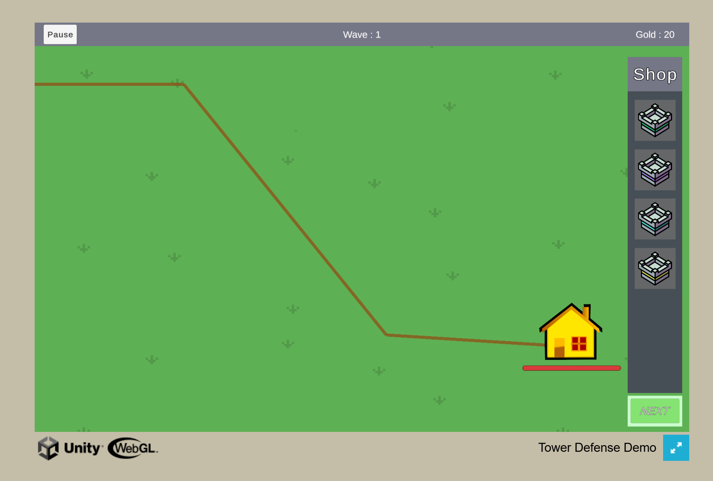

## Introduction

Welcome to the 2D Unity Tower Defense Demo! This is a short demo showcasing a basic tower defense game built using Unity. The project includes essential features such as enemy pathfinding, tower placement, and upgradeable towers! The primary objective is to prevent enemies from reaching the end of the path by strategically placing and upgrading towers.

## Play The Game!
You can play the game directly on ([itch here](https://la-jer.itch.io/tower-defense-demo))!

## Features

- **Enemy Pathfinding**: Enemies follow a predetermined path from start to finish.
- **Tower Placement**: Players can place towers anywhere on the map, except directly on the enemy path
- **Upgradeable Towers**: Towers can be upgraded to enhance their capabilities. 
- **Various Enemy Types**: Different enemies with unique attributes.
- **Basic UI**: Interface to manage game elements like health, currency, and tower upgrades.

